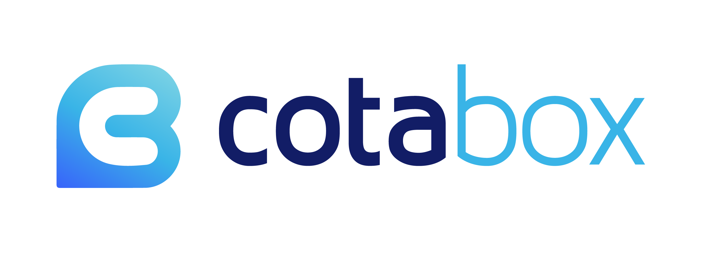

  

# { "developer": "fullstack" }

O objetivo do desafio é avaliar seu domínio fullstack: organização, coding style e boas práticas, além do uso de ferramentas e frameworks para a criação de APIs e telas front-end.

## Rules

1. Seu código deve estar disponível em um repositório público; caso prefira um repositório privado, iremos enviar os "usernames" para adicionar ao repositório depois de nos enviar o link;
2. Envie o repositório para desenvolvimento@cotabox.com.br;

Nós usamos VueJS, node.js, graphQL e MongoDB, mas sinta-se à vontade para usar o que lhe for mais confortável.

## Challenge

### Front-end

O seguinte layout deve ser criado:

[Baixe o layout aqui, se preferir](layout-onepage.psd)

Requisitos:
- Você pode usar bibliotecas e frameworks que preferir;
- Todos os campos são obrigatórios;
- Será um diferencial se adicionar testes unitários.

### Back-end

A tela a ser criada possui uma tabela e informações em porcentagem referentes à cada participante da distribuição.

- Você precisará desenvolver uma API para enviar e receber essas informações;
- Será um diferencial se cobrir seu código com testes unitários;
- Em caso de inconsitência ou erros de validação, por ex, esperemos que a API retorne o erro adequadamente (com erro 400).

#### Plus

Fique à vontade para fazer melhorias, como novas funcionalidade, visual diferente, segurança na API, o que quiser :)

É um grande diferencial se conseguir hospedar seu desafio, mas se não puder, incluir um Docker ou docker-compose será de bom tamanho.

## Questions?

Caso tenha dúvidas nos envie um e-mail: desenvolvimento@cotabox.com.br
