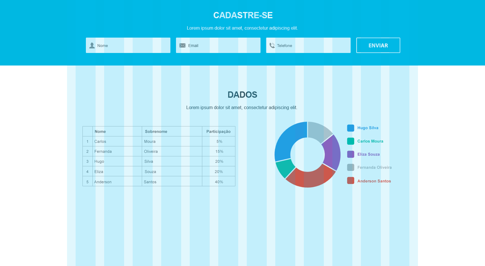

  

# { "developer": "fullstack" }

The objective of this challenge is to evaluate your domain in fullstack development: its organization, style and good practices with code, APIs creation, frameworks knowledge and technologies.

## Rules

1. Your code should be made available in a public or private repository, on your personal github or bitbucket;
2. Send the link to dev@cubo.network;
3. We use Angular and Node.js with Serverless, but please feel free to choose other technologies;

## Challenge

### Front-end

The following layout should be developed

[You can download the PSD here](layout-onepage.psd)

- You can use the libs and frameworks that make you more comfortable;
- All fields are required in the form;
- We'll be happy if you develop tests for it;

### Back-end

The layout has a form, a table with percentage information of participation and a pizza graph that represents this distribution.

- You need to create APIs that sends and receives these informations;
- We'll be happy if you develop tests for it;
- In case of inconsistency, return the error in a structured JSON with HTTP 400 code;

#### Plus

Feel free to make improviments like new funcionalities, visual optimizations, API security, etc. 😉

## Questions?

Send your questions directly to dev@cubo.network or opening a issue.
